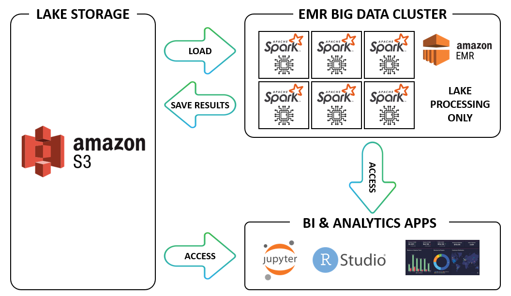
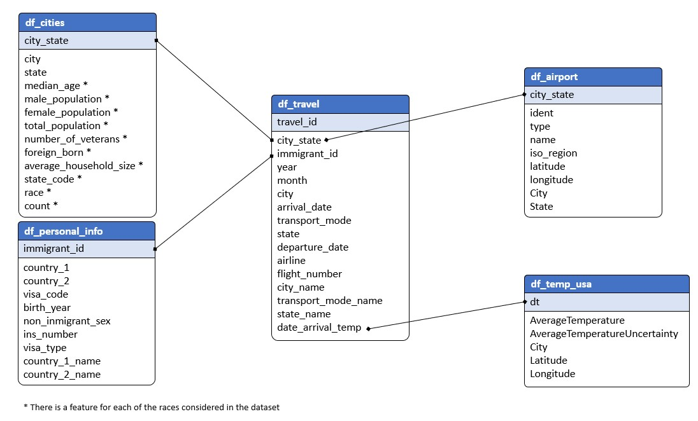
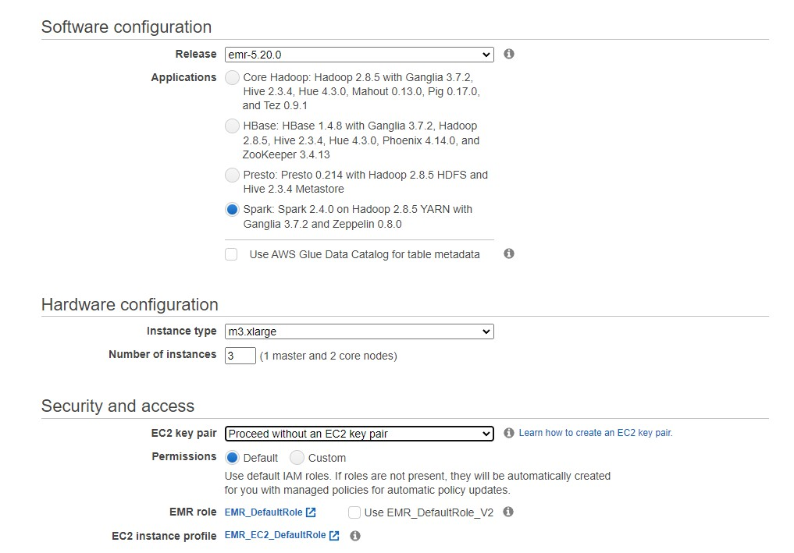
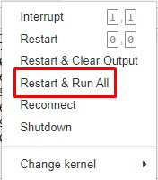

# **DATA LAKE - IMMIGRATION IN THE USA**

## **INTRODUCTION**

The purpose of this project is to create a data lake with data about immigration in the USA and other factors that can be used to carry out different types of analysis. 

With this data lake it would be possible to perform analyses about the number of immigrants arriving in the USA, through which airports they arrive or if the temperatures affect their choice of when to travel to the USA, among many other analyses.

The main difficulty of this analysis is to prepare the data in a way that makes it much easier for data scientists and analysts to extract information, conclusions, and predictive models from the data.

In this project tools like Apache Spark or the Pandas library has been used. Apache Airflow has been used to read, modify, and save the two biggest datasets, I94 Immigration Data and World Temperature Data. It has been done like this because of two main reasons: the first one is that is easier and faster to modify so big files with this tool and the second is that, although in this case we could still have used Pandas, in case that the datasets would have increased, this code could not have been applied because of the size of the datasets. For that reason, Apache Spark has been applied to the two biggest datasets and the ones that potentially could grow in the future: in case of scalation of the datasets, this could be keep using.

---

## **DATA LAKE WORKFLOW**

---

## **DATABASE SCHEMA**

---

## **FILES DESCRIPTION**
- **I94 Immigration Data:** : This data comes from the US National Tourism and Trade Office. A data dictionary is included in the workspace. This is where the data comes from. The National Travel and Tourism Office (NTTO) manages the ADIS/I-94 visitor arrivals program in cooperation with the Department of Homeland Security (DHS)/U.S. Customs and Border Protection (CBP). The I-94 provides a count of visitor arrivals to the United States (with stays of 1-night or more and visiting under certain visa types) to calculate U.S. travel and tourism volume exports.  
- **U.S. City Demographic Data:**: This data comes from OpenSoft. You can read more about it [here](https://public.opendatasoft.com/explore/dataset/us-cities-demographics/export/).
- **Airport Code Table:**: This is a simple table of airport codes and corresponding cities. It comes from [here](https://datahub.io/core/airport-codes#data).
- **World Temperature Data:**  This dataset came from Kaggle. You can read more about it [here](https://www.kaggle.com/datasets/berkeleyearth/climate-change-earth-surface-temperature-data).
- **faa_code.csv:** File with the FAA Codes. The data comes from [here](https://www.faa.gov/air_traffic/flight_info/aeronav/aero_data/Loc_ID_Search/Encodes_Decodes/).
- **ISO_code_US.csv:** File with the ISO codes of the USA states.
- **I94_SAS_Labels_Descriptions:** File with information about the I95 Immigration Data. In this file is possible to find descriptions of each of the columns which are part of the dataset.

---

## **HOW TO RUN THE SCRIPTS?**

**CREATE AN EMR CLUSTER**

To run this code, it is necessary to create an Amazon EMR (Elastic Map Reduce) cluster. It can be set with the following definition:

After having created the cluster, the notebook can be uploaded and run.

**JUPYTER NOTEBOOK**

The first thing to do is to upload the notebook to the EMR cluster. The Jupyter Notebook has been defined in a way that anyone can choose "Restart and Run All" to run the code.

---

**ALTERNATIVE SCENARIOS**

* **If the data was increased by 100x:** In this dataset, some big data tools has been already used like Apache Spark. Apache Spark has been used in the two datasets which could potentially increase, like the immigration and temperature dataset. The rest of the datasets could increase both probably they can not grow so much to be considerated as big data. Nevertheless, in case that the data would have increased by x100, Spark would be completely necessary to parallelize the operations to be performed and it is very likely that the confirmation of the EMR should change, being necessary to use either more nodes or nodes with better computational power.
* **If the pipelines were run on a daily basis by 7am:** In case the pipelines would run on a daily basis, the results would be completely updated but probably that would not have a relevant impact on the results of the analysis. The best option would be to run it on a monthly basis.
* **If the database needed to be accessed by 100+ people:** In this case, the first thing I would do is to create a group of users, so I do not need to grant person-to-person permits. That can be managed from the Amazon IAM. From other side, that would not have an impact on the computational needs. Although so many people would have access, it would be very relevant to understand the frequency of the queries, to determine if the data has be highly availabe or if this data can be stored in a bucket with other characteristics and prices. 
- **Apache Airflow**: This project could have been done in Apache Airflow to update the data in a given period of time, which in this case I think it should have been run in a monthly basis. However, I have not deployed it in Airflow for the sake of limitation. In any case, it has been defined through functions to facilitate that it can be taken to Apache Airflow to be able to apply a data pipeline to it.

---
## **LICENSING, AUTHORS, ACKNOWLEDGEMENTS, ETC.**
- **Author**: The author of this project is Gonzalo Gomez Millan
- **Acknowledgment**: Also noteworthy is the work of **Udacity** by promoting  this analysis as the capstone project for the Data Engineering Nanodegree Program.