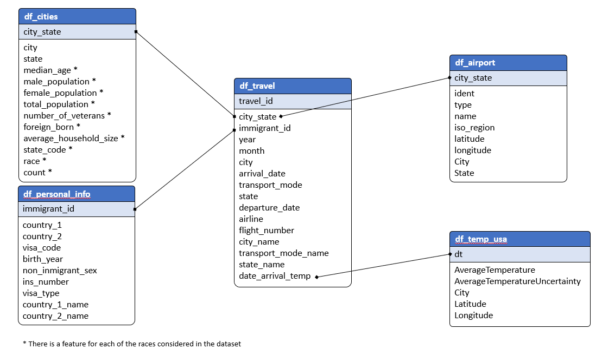

# **DATA LAKE - IMMIGRATION IN THE USA**

## **INTRODUCTION**
...

---

## **DATA LAKE WORKFLOW**

---

## **INPUT DATA**

**...**: ...

**...**: ...

**...**: ...

**...**: ...

**...**: ...

**...**: ...

**...**: ...

---

## **DATABASE SCHEMA**

---

## **FILES DESCRIPTION**
- **...** : ...
- **...**: ...
- **...**: ...

---

## **HOW TO RUN THE SCRIPTS?**

**CREATE AN EMR CLUSTER**

...

**JUPYTER NOTEBOOK**

...

---
## **LICENSING, AUTHORS, ACKNOWLEDGEMENTS, ETC.**
- **Author**: The author of this project is Gonzalo Gomez Millan
- **Acknowledgment**: Also noteworthy is the work of **Udacity** by promoting  this analysis as the capstone project for the Data Engineering Nanodegree Program.